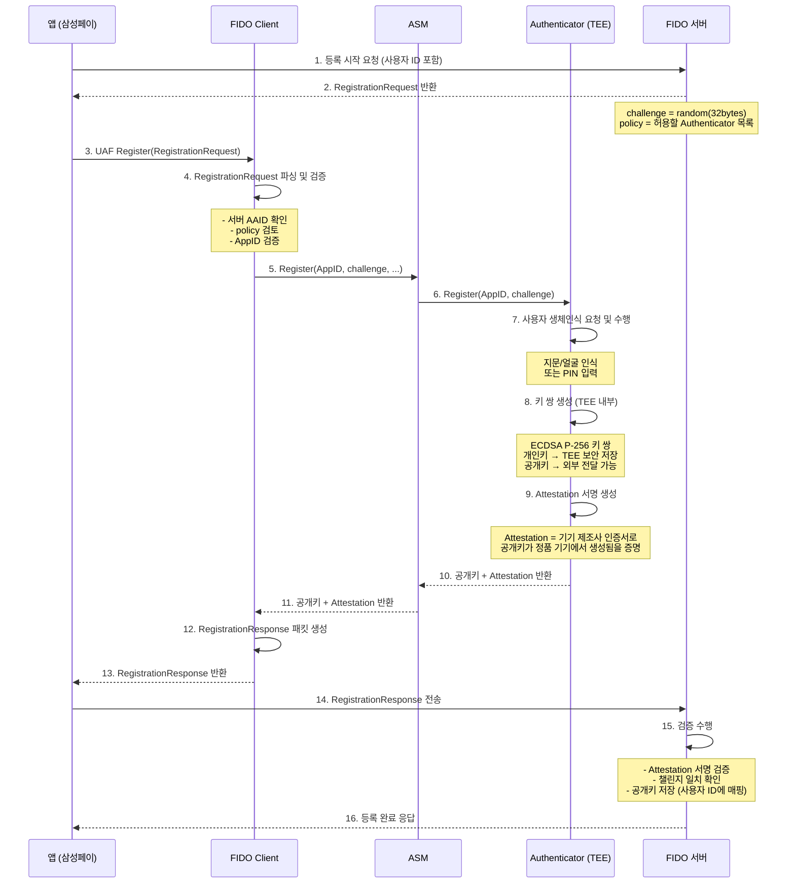
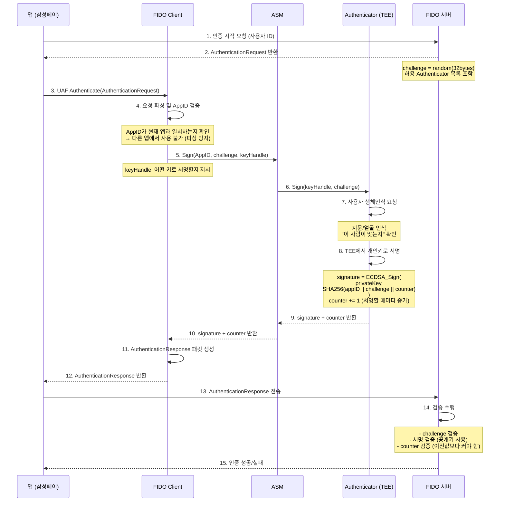

# 02. UAF 심층 분석 — 삼성페이 지문인증은 어떻게 동작하는가

UAF(Universal Authentication Framework)는 우리가 구축한 스펙입니다.
"모바일 앱에서 생체인식으로 비밀번호를 완전히 대체한다"는 것이 목표입니다.

---

## 1. UAF 전체 구조

```
┌─────────────────────────────────────────────────────────────┐
│                       사용자 스마트폰                        │
│                                                             │
│  ┌──────────────┐     ┌─────────────┐     ┌─────────────┐  │
│  │   앱 / SDK   │────>│ FIDO Client │────>│     ASM     │  │
│  │  (삼성페이)  │     │             │     │  (브릿지)   │  │
│  └──────────────┘     └─────────────┘     └──────┬──────┘  │
│                                                  │          │
│                                          ┌───────▼───────┐  │
│                                          │ Authenticator │  │
│                                          │ ┌───────────┐ │  │
│                                          │ │    TEE    │ │  │
│                                          │ │ (개인키)  │ │  │
│                                          │ └───────────┘ │  │
│                                          │ 지문센서/FaceID│  │
│                                          └───────────────┘  │
└─────────────────────────────────────────────────────────────┘
                              │  HTTPS
                    ┌─────────▼──────────┐
                    │    FIDO 서버       │
                    │  (우리가 구축한것) │
                    │  - 공개키 저장     │
                    │  - 챌린지 생성     │
                    │  - 서명 검증       │
                    └────────────────────┘
```

### 각 컴포넌트 역할

| 컴포넌트 | 역할 | 예시 |
|---------|------|------|
| **앱/SDK** | FIDO Client를 호출하는 최상위 레이어 | 삼성페이 앱 |
| **FIDO Client** | UAF 프로토콜 처리. 서버 메시지 파싱/생성 | 기기 내장 FIDO 라이브러리 |
| **ASM** | FIDO Client ↔ Authenticator 사이 중간 레이어. 여러 Authenticator 추상화 | Android Keystore ASM |
| **Authenticator** | 실제 인증 수행. TEE 내 키 관리 | 삼성 지문 인증기 |
| **TEE** | 개인키가 사는 보안 격리 공간 | ARM TrustZone |

---

## 2. 등록 흐름 (Registration)

### 시퀀스 다이어그램



### 등록 시 서버가 하는 일 (15번 단계 상세)

```
1. challenge 검증
   - 내가 발급한 challenge인가?
   - 아직 만료되지 않았는가? (보통 5분 이내)
   - 이미 사용된 challenge인가? (리플레이 방지)

2. Attestation 검증
   - Attestation 서명이 유효한가?
   - FIDO Alliance Metadata Service에서 해당 Authenticator가 신뢰할 수 있는가?
   - Authenticator가 revoke(취소)되지 않았는가?

3. 공개키 저장
   - 사용자 ID + AAID(인증기 식별자) + 공개키 를 DB에 저장
   - SignCounter 초기값 0으로 저장 (리플레이 방지용)
```

---

## 3. 인증 흐름 (Authentication)

### 시퀀스 다이어그램



### 서명 검증 로직 상세 (14번 단계)

```python
# 의사코드 (pseudocode)
def verify_authentication(response, stored_user):
    # 1. 챌린지 검증
    if response.challenge != session.challenge:
        return FAIL("challenge 불일치")
    if is_expired(session.challenge_time):
        return FAIL("challenge 만료")

    # 2. AppID 검증 (피싱 방지 핵심)
    if response.app_id != expected_app_id:
        return FAIL("AppID 불일치 - 피싱 의심")

    # 3. 서명 검증
    signed_data = SHA256(response.app_id + response.challenge + response.counter)
    public_key = stored_user.public_key
    if not ECDSA_Verify(public_key, signed_data, response.signature):
        return FAIL("서명 검증 실패")

    # 4. 카운터 검증 (클론 기기 탐지)
    if response.counter <= stored_user.last_counter:
        return FAIL("카운터 이상 - 기기 클론 의심")
    stored_user.last_counter = response.counter

    return SUCCESS
```

---

## 4. SignCounter — 기기 복제 탐지

UAF의 흥미로운 보안 기능 중 하나.

### 원리

```
기기 내 Authenticator는 서명할 때마다 카운터를 1씩 올린다.

정상 시나리오:
  기기:  counter = 5 → 서명 → counter = 6
  서버:  6 > 5 (저장값) → 정상 ✓

기기 복제 시나리오:
  공격자가 기기를 복제하고 counter = 5 상태에서 시작
  진짜 기기가 이미 counter = 10까지 사용했다면:
  공격자:  counter = 6 전송
  서버:   6 < 10 (저장값) → 이상 감지 ✗
```

### 서버의 대응

```
if counter <= stored_counter:
    # 기기가 복제되었을 가능성
    # 정책에 따라:
    # - 인증 거부 + 사용자에게 알림
    # - 해당 등록 자격증명 비활성화
    # - 보안팀 알림
```

---

## 5. Attestation — "이 기기는 정품인가?"

등록 시에만 사용되는 개념. 인증기 자체의 신뢰성을 검증.

### Attestation 유형

```
Full Basic Attestation (가장 강력):
  - 기기마다 고유한 Attestation 키 보유
  - 제조사 CA가 각 기기의 Attestation 공개키에 서명
  - 서버가 제조사 CA를 신뢰하면 기기 신뢰 가능
  - 단점: 특정 기기 추적 가능 (프라이버시 이슈)

Surrogate (Basic) Attestation:
  - 기기마다 별도 키 없이, 일반 FIDO 키로 Attestation 수행
  - 프라이버시는 보호되나 기기 신뢰성 보증 약함

None Attestation:
  - Attestation 생략
  - FIDO2에서 허용됨
  - 서버가 Authenticator 신뢰성 검증 포기
```

### Metadata Service

FIDO Alliance는 **MDS (Metadata Service)** 를 운영한다.
서버는 MDS를 통해 모든 공식 인증 Authenticator 목록과 신뢰 정보를 받을 수 있다.

```
등록 시 서버 처리:
  1. 기기가 보낸 AAID (Authenticator ID) 확인
  2. MDS에서 해당 AAID의 메타데이터 조회
  3. Attestation 루트 인증서 가져오기
  4. 서명 검증
  → "이 기기는 삼성 갤럭시 S24, FIDO 인증 획득, 신뢰 가능"
```

---

## 6. UAF 메시지 구조

### RegistrationRequest (서버 → 클라이언트)

```json
{
  "header": {
    "upv": { "major": 1, "minor": 1 },
    "op": "Reg",
    "appID": "https://mybank.com/fido/app-facets.json",
    "serverData": "eyJ..."
  },
  "challenge": "YSBjaGFsbGVuZ2UgdGhhdA",
  "username": "user@mybank.com",
  "policy": {
    "accepted": [
      [{ "aaid": ["0013#0001"] }],
      [{ "keyProtection": 6 }]
    ]
  }
}
```

- `challenge`: Base64URL 인코딩된 무작위값
- `policy.accepted`: 허용할 Authenticator 조건 목록
- `appID`: 이 서비스의 ID. Authenticator가 도메인 바인딩에 사용

### RegistrationResponse (클라이언트 → 서버)

```json
{
  "assertions": [{
    "assertionScheme": "UAFV1TLV",
    "assertion": "AT7uAgM..."
  }],
  "header": {
    "upv": { "major": 1, "minor": 1 },
    "op": "Reg",
    "appID": "https://mybank.com/fido/app-facets.json",
    "serverData": "eyJ..."
  },
  "fcParams": "eyJjaGFsbGVuZ2UiOi..."
}
```

- `assertion`: TLV 형식으로 인코딩된 공개키 + Attestation
- `fcParams`: FinalChallengeParams. challenge + appID + facetID를 포함한 클라이언트 측 데이터

---

## 7. AppID와 FacetID — 피싱 방지 메커니즘

UAF에서 피싱을 막는 핵심 메커니즘.

### AppID

```
AppID = 서비스를 식별하는 URL
예: "https://mybank.com/fido/app-facets.json"
```

이 URL에는 **허용된 앱 목록(FacetID)**이 JSON으로 서빙된다.

### FacetID

```
안드로이드 앱:  "android:apk-key-hash:<앱 서명 해시>"
iOS 앱:         "ios:bundle-id:<번들 ID>"
웹:             "https://mybank.com"
```

### 검증 흐름

```
1. 앱이 FIDO Client에 인증 요청
2. FIDO Client가 AppID URL을 fetch → 허용된 FacetID 목록 다운로드
3. 현재 앱의 FacetID (앱 서명 해시)가 목록에 있는지 확인
4. 없으면 인증 거부 → 피싱 앱 원천 차단
```

```
정상:
  MyBank 공식 앱 (FacetID: android:apk-key-hash:ABC123)
  → AppID 목록에 포함 → 인증 허용 ✓

피싱:
  가짜 MyBank 앱 (FacetID: android:apk-key-hash:XYZ999)
  → AppID 목록에 없음 → 인증 거부 ✗
```

---

## 8. UAF 서버 핵심 기능 요약

우리가 구축한 FIDO 서버가 수행해야 하는 핵심 기능:

```
[등록 처리]
  POST /uaf/1.1/registration/request   → RegistrationRequest 생성 및 반환
  POST /uaf/1.1/registration/response  → RegistrationResponse 검증 및 공개키 저장

[인증 처리]
  POST /uaf/1.1/authentication/request  → AuthenticationRequest 생성 및 반환
  POST /uaf/1.1/authentication/response → AuthenticationResponse 검증

[해지 처리]
  POST /uaf/1.1/deregistration         → 특정 기기의 등록 취소

[DB에 저장하는 것]
  - 사용자 ID
  - AAID (Authenticator 종류)
  - KeyID (특정 Authenticator의 특정 키 식별자)
  - 공개키 (Base64 or DER 형식)
  - SignCounter (마지막 서명 카운터값)
  - 등록 시각
  - 기기 정보
```

---

## 체크리스트

- [ ] FIDO Client, ASM, Authenticator의 역할 차이를 설명할 수 있는가?
- [ ] 등록 시 서버는 무엇을 저장하는가?
- [ ] 인증 시 서버는 무엇을 검증하는가?
- [ ] SignCounter가 없으면 어떤 공격이 가능한가?
- [ ] AppID/FacetID 검증이 없으면 어떤 공격이 가능한가?
- [ ] Attestation의 목적은 무엇인가?
