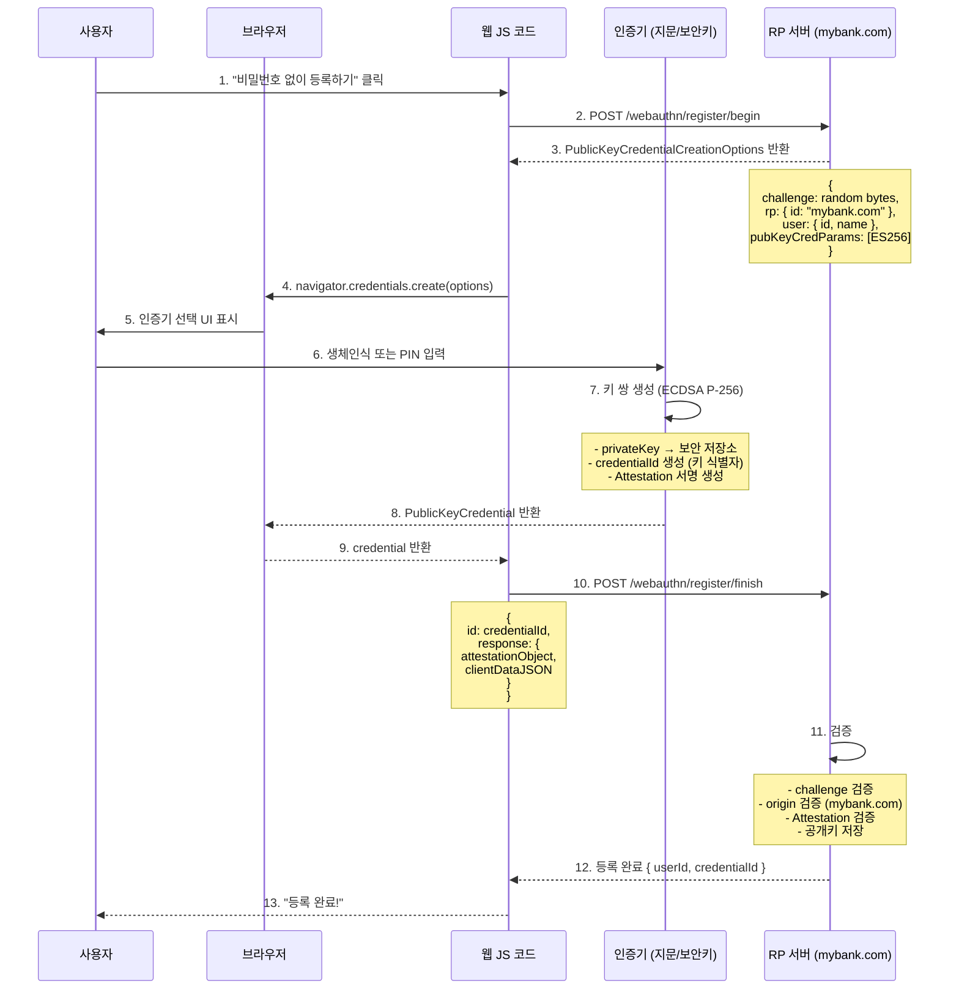
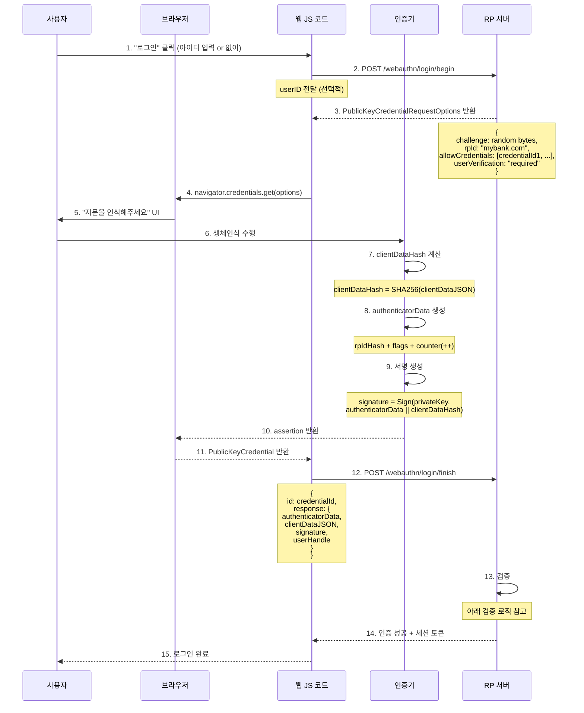

# 03. FIDO2 / WebAuthn 심층 분석 — 브라우저에서의 비밀번호 없는 인증

FIDO2는 UAF의 아이디어를 **웹 브라우저** 환경으로 가져온 표준입니다.
W3C 표준(WebAuthn)과 FIDO Alliance 표준(CTAP)으로 구성됩니다.

---

## 1. FIDO2 = WebAuthn + CTAP

```
┌─────────────────────────────────────────────────────────┐
│                      웹 서비스 (RP)                      │
│                  mybank.com 서버                         │
└──────────────────────────┬──────────────────────────────┘
                           │ HTTPS (WebAuthn 서버 프로토콜)
┌──────────────────────────▼──────────────────────────────┐
│                    웹 브라우저                           │
│                                                         │
│  ┌────────────────────────────────────────────────┐     │
│  │           WebAuthn API (W3C 표준)              │     │
│  │  navigator.credentials.create()               │     │
│  │  navigator.credentials.get()                  │     │
│  └───────────────────────┬────────────────────────┘     │
│                          │ CTAP2 (USB/NFC/BLE)          │
└──────────────────────────┼──────────────────────────────┘
                           │
           ┌───────────────┼───────────────┐
           ▼               ▼               ▼
    ┌─────────────┐  ┌──────────┐  ┌────────────┐
    │ 내장 인증기 │  │ USB 보안키│  │ 스마트폰  │
    │ (Windows   │  │(YubiKey  │  │ (Passkey) │
    │  Hello 등) │  │ 등)      │  │           │
    └─────────────┘  └──────────┘  └────────────┘
```

### WebAuthn vs CTAP 역할 분리

| | WebAuthn | CTAP |
|--|---------|------|
| 정의 기관 | W3C | FIDO Alliance |
| 역할 | 브라우저 JS API + 서버 프로토콜 | 브라우저 ↔ 외부 인증기 통신 |
| 누가 구현 | 브라우저 제조사 | 인증기 제조사 (Yubico 등) |
| 버전 | WebAuthn L1, L2, L3 | CTAP1(U2F 호환), CTAP2 |

---

## 2. 등록 흐름 — 브라우저에서의 키 등록

### 시퀀스 다이어그램



### 서버가 받는 데이터 구조

```
PublicKeyCredential {
  id: "dGhpcyBpcyBhIGNyZWRlbnRpYWxJZA",  // Base64URL encoded credential ID
  rawId: ArrayBuffer,
  response: AuthenticatorAttestationResponse {
    clientDataJSON: {               // 브라우저가 생성
      type: "webauthn.create",
      challenge: "...",             // 서버가 보낸 challenge
      origin: "https://mybank.com", // 현재 도메인 (피싱 방지!)
      crossOrigin: false
    },
    attestationObject: {            // 인증기가 생성 (CBOR 인코딩)
      fmt: "packed",
      authData: {
        rpIdHash: SHA256("mybank.com"),  // RP ID 해시
        flags: { UP: true, UV: true },   // 사용자 확인 여부
        counter: 0,
        credentialId: ...,
        credentialPublicKey: {           // ← 서버가 저장하는 공개키
          kty: 2 (EC),
          alg: -7 (ES256),
          crv: 1 (P-256),
          x: ...,
          y: ...
        }
      },
      attStmt: { ... }  // Attestation 서명
    }
  }
}
```

---

## 3. 인증 흐름 — 브라우저에서의 로그인

### 시퀀스 다이어그램



### 서버 검증 로직 상세

```python
# 의사코드 (pseudocode)
def verify_authentication(response):
    # 1. clientDataJSON 파싱 및 검증
    client_data = parse_json(response.clientDataJSON)

    assert client_data.type == "webauthn.get"
    assert client_data.challenge == session.challenge  # 내가 발급한 챌린지?
    assert client_data.origin == "https://mybank.com"  # 올바른 도메인?

    # 2. authenticatorData 파싱
    auth_data = parse(response.authenticatorData)

    assert auth_data.rpIdHash == SHA256("mybank.com")  # 올바른 RP?
    assert auth_data.flags.UP == True   # 사용자가 물리적으로 행위를 했는가?
    assert auth_data.flags.UV == True   # 사용자 신원 확인 완료?

    # 3. 카운터 검증
    credential = db.get_credential(response.credentialId)
    if auth_data.counter > 0:  # 0이면 카운터 미지원 기기 (소프트웨어 인증기)
        assert auth_data.counter > credential.storedCounter
    credential.storedCounter = auth_data.counter

    # 4. 서명 검증 (핵심)
    client_data_hash = SHA256(response.clientDataJSON)
    verification_data = response.authenticatorData + client_data_hash

    public_key = credential.publicKey
    assert ECDSA_Verify(public_key, verification_data, response.signature)

    return SUCCESS
```

---

## 4. WebAuthn API 코드 예시 (JavaScript)

실제 브라우저에서 동작하는 코드.

### 등록

```javascript
// 서버에서 옵션 가져오기
const response = await fetch('/webauthn/register/begin', {
  method: 'POST',
  body: JSON.stringify({ username: 'user@mybank.com' })
});
const options = await response.json();

// Base64URL → ArrayBuffer 변환 (브라우저 API는 ArrayBuffer 사용)
options.challenge = base64urlToBuffer(options.challenge);
options.user.id = base64urlToBuffer(options.user.id);

// 브라우저 WebAuthn API 호출
// 이 시점에 브라우저가 인증기 선택 UI를 보여줌
const credential = await navigator.credentials.create({
  publicKey: options
});

// ArrayBuffer → Base64URL 변환 후 서버로 전송
const result = await fetch('/webauthn/register/finish', {
  method: 'POST',
  body: JSON.stringify({
    id: credential.id,
    rawId: bufferToBase64url(credential.rawId),
    response: {
      attestationObject: bufferToBase64url(credential.response.attestationObject),
      clientDataJSON: bufferToBase64url(credential.response.clientDataJSON)
    }
  })
});
```

### 인증

```javascript
// 서버에서 챌린지 가져오기
const options = await fetch('/webauthn/login/begin', {
  method: 'POST',
  body: JSON.stringify({ username: 'user@mybank.com' })
}).then(r => r.json());

options.challenge = base64urlToBuffer(options.challenge);
options.allowCredentials = options.allowCredentials?.map(c => ({
  ...c,
  id: base64urlToBuffer(c.id)
}));

// 인증 실행 (지문 UI 표시됨)
const assertion = await navigator.credentials.get({
  publicKey: options
});

// 서버로 전송
await fetch('/webauthn/login/finish', {
  method: 'POST',
  body: JSON.stringify({
    id: assertion.id,
    response: {
      authenticatorData: bufferToBase64url(assertion.response.authenticatorData),
      clientDataJSON: bufferToBase64url(assertion.response.clientDataJSON),
      signature: bufferToBase64url(assertion.response.signature),
      userHandle: assertion.response.userHandle
        ? bufferToBase64url(assertion.response.userHandle)
        : null
    }
  })
});
```

---

## 5. Resident Key (상주 키) — Passkey의 기술 기반

### 일반 자격증명 vs Resident Key

```
일반 자격증명:
  - keyHandle이 서버에 저장됨
  - 인증 시 서버가 keyHandle을 클라이언트에 전달
  - 서버가 사용자 식별 후 → allowCredentials에 넣어서 전달
  - 단점: 사용자를 먼저 알아야 인증 가능 (usernameless 불가)

Resident Key (Discoverable Credential):
  - keyHandle + 사용자 ID가 인증기 내부에 저장됨
  - 서버가 allowCredentials를 비워도 인증기가 스스로 찾아냄
  - 진정한 usernameless 로그인 가능
  - Passkey는 이것을 클라우드 동기화 가능하게 확장한 것
```

### Resident Key 등록 시 옵션

```javascript
const options = {
  // ...
  authenticatorSelection: {
    residentKey: "required",     // 상주 키 필수 요구
    requireResidentKey: true,    // 구형 호환성
    userVerification: "required" // 생체인식/PIN 필수
  }
};
```

---

## 6. UAF vs FIDO2 핵심 차이

| 항목 | UAF | FIDO2 (WebAuthn) |
|------|-----|-----------------|
| 환경 | 모바일 앱 | 웹 브라우저 |
| 표준 기관 | FIDO Alliance | W3C + FIDO Alliance |
| 클라이언트 구현 | 앱 내 SDK | 브라우저 내장 |
| 프로토콜 형식 | JSON TLV | CBOR + JSON |
| AppID 검증 | FacetID (앱 서명 해시) | origin (도메인) |
| 기기 간 동기화 | 불가 | Passkey로 가능 |
| 상주 키 | 없음 | 있음 (Resident Key) |

---

## 체크리스트

- [ ] WebAuthn API의 두 핵심 함수는 무엇인가?
- [ ] clientDataJSON에 origin이 포함되는 이유는?
- [ ] authenticatorData에 counter가 포함되는 이유는?
- [ ] Resident Key가 일반 자격증명과 다른 점은?
- [ ] UAF의 AppID/FacetID와 WebAuthn의 origin은 어떤 역할을 하는가?
