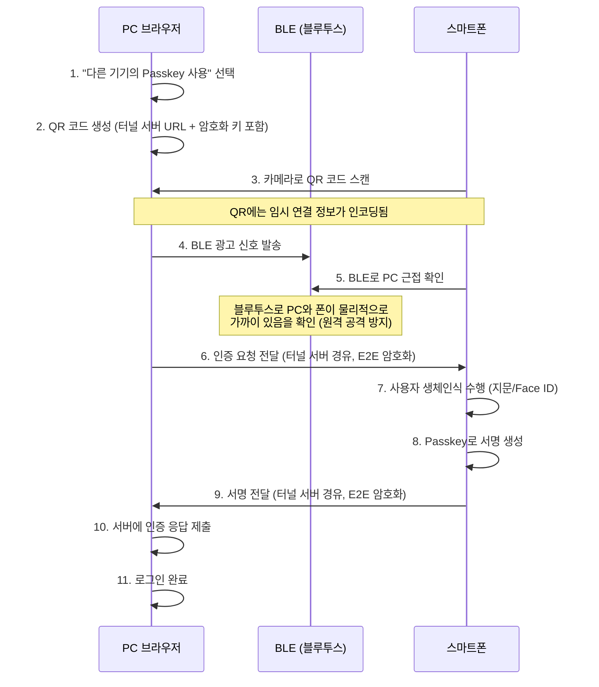

# 05. Passkey 심층 분석 — 기기를 잃어버려도 왜 안전한가

Passkey는 FIDO2의 최신 진화 형태입니다.
"기기에 묶인 FIDO 자격증명"의 가장 큰 단점(기기 분실 시 재등록 필요)을 해결하면서도 보안을 유지합니다.

---

## 1. Passkey가 나온 배경

### 기존 FIDO2의 문제

```
기존 FIDO2 자격증명:
  - 한 기기에만 존재
  - 스마트폰 분실 → 등록된 모든 서비스에서 재등록 필요
  - 새 기기 구매 → 처음부터 다시 등록
  - 사용자 경험(UX) 측면에서 비밀번호보다 불편한 상황 발생
```

### Passkey의 해결책

```
Passkey = FIDO2 자격증명 + 클라우드 동기화

  iCloud 키체인 (애플)
  구글 비밀번호 관리자 (구글)
  Windows Hello / Microsoft 인증기 (마이크로소프트)

  → 기기가 바뀌어도 자격증명이 자동으로 복원됨
  → 기기 분실 시 새 기기로 복구 가능
```

---

## 2. Passkey의 두 가지 종류

```
┌─────────────────────────────────────────────────────────┐
│                      Passkey                             │
├───────────────────────────┬─────────────────────────────┤
│   Synced Passkey          │   Device-bound Passkey       │
│   (동기화 Passkey)         │   (기기 고정 Passkey)         │
├───────────────────────────┼─────────────────────────────┤
│ 클라우드에 암호화되어 저장  │ 기기 내 TEE에만 존재         │
│ 여러 기기에서 사용 가능    │ 기기 이전 불가               │
│ 기기 분실 후 복구 가능     │ 기기 분실 시 재등록 필요     │
│ 예: iCloud 키체인 Passkey  │ 예: FIDO2 USB 보안키         │
│ 보안 수준: 높음            │ 보안 수준: 매우 높음          │
│ 편의성: 매우 높음          │ 편의성: 낮음                 │
└───────────────────────────┴─────────────────────────────┘
```

일반 소비자에게 "Passkey"라고 하면 보통 **Synced Passkey**를 의미합니다.

---

## 3. 클라우드 동기화 원리 — 어떻게 안전하게 동기화하는가

"클라우드에 저장한다"고 하면 개인키가 서버에 올라가는 것 아닌가? 라고 의문이 들 수 있습니다.

### 애플 iCloud 키체인의 동기화 방식

```
[iPhone A의 Passkey 생성]
  1. 개인키를 기기 Secure Enclave에서 생성
  2. 개인키를 iCloud 키체인 암호화 키로 암호화
     ← 이 암호화 키는 사용자의 Apple ID + 기기 비밀번호로 보호
  3. 암호화된 개인키를 iCloud에 업로드

[새 iPhone B에서 복원]
  1. iCloud에서 암호화된 개인키 다운로드
  2. Apple ID 인증 + 기기 비밀번호로 복호화
  3. 개인키를 iPhone B의 Secure Enclave에 저장

핵심:
  - Apple 서버도 개인키를 볼 수 없음 (End-to-End 암호화)
  - 개인키 복호화는 사용자 기기에서만 가능
  - Apple이 해킹되어도 개인키는 안전
```

### 구글 비밀번호 관리자의 동기화 방식

```
  PIN 기반 암호화 (Screen Lock PIN과 연동)
  → 기기 PIN을 모르면 복호화 불가
  → 구글 서버는 암호화된 blob만 저장, 키 없음
```

---

## 4. 크로스 디바이스 인증 (Hybrid Transport)

Passkey의 가장 강력한 기능 중 하나.
PC에서 로그인할 때 **스마트폰의 생체인식**으로 인증 가능.

### 시퀀스 다이어그램



### BLE 근접 확인의 중요성

```
BLE (Bluetooth Low Energy) 근접 확인이 없다면:
  공격자가 원격에서 피해자의 폰으로 인증을 강제 유도 가능
  (사회공학 공격: "이 QR 찍어보세요~")

BLE 확인이 있으면:
  PC와 스마트폰이 물리적으로 같은 공간에 있어야 함
  → 원격 공격 불가
  → "내가 로그인하려는 PC에서 스캔한 QR"임이 보장됨
```

---

## 5. Passkey 등록 흐름 (WebAuthn 기반)

Passkey는 기술적으로 WebAuthn의 **Resident Key** + 동기화입니다.

### 등록 시 서버 옵션

```javascript
// 서버가 Passkey 등록을 위해 반환하는 옵션
const creationOptions = {
  challenge: randomBytes(32),
  rp: {
    id: "mybank.com",
    name: "My Bank"
  },
  user: {
    id: userId,          // 사용자 식별자 (userHandle)
    name: "user@mybank.com",
    displayName: "홍길동"
  },
  pubKeyCredParams: [
    { type: "public-key", alg: -7 },   // ES256 (ECDSA P-256)
    { type: "public-key", alg: -257 }  // RS256 (RSA, 호환성용)
  ],
  authenticatorSelection: {
    // Passkey를 위한 핵심 설정
    residentKey: "required",       // 인증기 내부에 사용자 ID 저장
    requireResidentKey: true,      // 구형 브라우저 호환
    userVerification: "required",  // 생체인식/PIN 필수 (UP만으로 불충분)
    authenticatorAttachment: "platform"  // 기기 내장 인증기 (폰, 노트북 지문)
    // "cross-platform"은 USB 보안키 등 외장 인증기
  },
  attestation: "none",  // 소비자 서비스에서는 보통 none
  timeout: 60000
};
```

### Passkey 등록 vs 일반 FIDO2 등록 차이

```
일반 FIDO2 등록:
  residentKey: "discouraged"
  → 인증기에 사용자 ID 저장 안 함
  → 서버가 allowCredentials에 credentialId를 넣어야 인증 가능
  → username first 로그인 (아이디 입력 후 인증기 찾기)

Passkey 등록:
  residentKey: "required"
  → 인증기에 credentialId + userHandle 저장
  → 서버가 allowCredentials 없이도 인증기가 자격증명 탐색 가능
  → usernameless 로그인 (아이디 입력 없이 바로 생체인식)
```

---

## 6. Passkey 인증 흐름

### Usernameless 로그인

```javascript
// 서버: username 없이 챌린지만 반환
const requestOptions = {
  challenge: randomBytes(32),
  rpId: "mybank.com",
  // allowCredentials 없음! → 인증기가 스스로 자격증명 탐색
  userVerification: "required",
  timeout: 60000
};

// 브라우저: 저장된 Passkey 목록을 사용자에게 보여줌
const assertion = await navigator.credentials.get({
  publicKey: requestOptions,
  // mediation: "conditional"  ← 자동완성 UI에 Passkey 표시 (선택적)
});

// 서버로 전달되는 assertion에는 userHandle이 포함됨
// → 서버가 이 userHandle로 사용자를 식별
```

### Conditional UI (자동완성 Passkey)

최신 기능. 비밀번호 자동완성 위치에 Passkey가 표시됨.

```html
<input type="text" name="username" autocomplete="username webauthn">
<!--
  "webauthn" 힌트를 넣으면 브라우저가
  비밀번호 자동완성 드롭다운에 저장된 Passkey를 함께 표시함
  → 사용자가 입력창을 클릭하면 Passkey 선택 UI가 자동으로 나타남
-->
```

---

## 7. 서버 관점: Passkey 처리 시 추가 고려사항

### backup_eligible / backup_state 플래그

```python
# authenticatorData의 flags에서 읽는 값
flags = {
    "UP": True,   # User Presence: 사용자가 물리적 행위를 했는가
    "UV": True,   # User Verification: 생체인식/PIN으로 신원 확인했는가
    "BE": True,   # Backup Eligible: 이 자격증명이 동기화 가능한가
    "BS": True,   # Backup State: 현재 실제로 동기화(백업)되어 있는가
}

# 보안 정책 결정에 활용
if credential.backup_eligible:
    # 이 자격증명은 여러 기기에 복제될 수 있음
    # 고보안 트랜잭션(이체 등)에는 추가 인증 요구 정책도 가능
    pass

if credential.backup_state:
    # 현재 클라우드에 백업(동기화)된 상태
    pass
```

### Passkey 등록 DB 저장 예시

```sql
INSERT INTO fido_credentials (
    user_id, credential_id, public_key, public_key_alg,
    sign_count, aaguid, transports,
    backup_eligible, backup_state,  -- Passkey 핵심 필드
    attestation_fmt, device_name
) VALUES (
    'user_123',
    'dGhpcyBpcyBhIGNyZWRlbnRpYWxJZA',
    X'...',          -- EC 공개키 (CBOR)
    -7,              -- ES256
    0,               -- 초기 카운터
    '08987058-cadc-4b81-b6e1-30de50dcbe96',  -- Apple Passkey AAGUID
    'internal,hybrid',  -- 내장 + 크로스 디바이스
    TRUE,            -- backup_eligible: 동기화 가능
    TRUE,            -- backup_state: 현재 동기화됨
    'none',
    'iPhone 15 Pro (홍길동)'
);
```

---

## 8. 주요 플랫폼별 Passkey 지원 현황

| 플랫폼 | 동기화 저장소 | 지원 버전 | 크로스 디바이스 |
|--------|-------------|----------|----------------|
| iOS / macOS | iCloud 키체인 | iOS 16+ / macOS 13+ | O (QR + BLE) |
| Android | 구글 비밀번호 관리자 | Android 9+ | O (QR + BLE) |
| Windows | Windows Hello / MS 계정 | Windows 10+ | O (QR + BLE) |
| Chrome | 구글 비밀번호 관리자 | Chrome 108+ | O |
| Safari | iCloud 키체인 | Safari 16+ | O |

### 서드파티 관리자

1Password, Bitwarden, Dashlane 등 주요 비밀번호 관리자도 Passkey 저장 지원.
사용자가 어느 관리자를 쓰든 서버 구현은 동일함 (WebAuthn 표준이므로).

---

## 9. Passkey 도입 시 고객사에 설명할 포인트

```
비밀번호 방식의 문제:
  → 사용자의 74%가 비밀번호를 재사용
  → 피싱으로 비밀번호 도용 시 막을 방법 없음
  → 비밀번호 초기화 지원 비용 발생

Passkey 도입 후:
  → 피싱 원천 차단 (도메인 바인딩)
  → 비밀번호 유출 걱정 없음 (서버에 없음)
  → 로그인 속도 향상 (비밀번호 입력 불필요)
  → 비밀번호 초기화 지원 비용 절감
  → Google/Apple/MS 공식 지원 생태계 활용
```

---

## 체크리스트

- [ ] Synced Passkey와 Device-bound Passkey의 차이는?
- [ ] 클라우드 동기화 시 Apple 서버는 개인키를 볼 수 있는가?
- [ ] 크로스 디바이스 인증에서 BLE가 필요한 이유는?
- [ ] residentKey: "required"가 없으면 왜 usernameless 로그인이 안 되는가?
- [ ] backup_eligible과 backup_state 플래그를 보안 정책에 어떻게 활용할 수 있는가?
